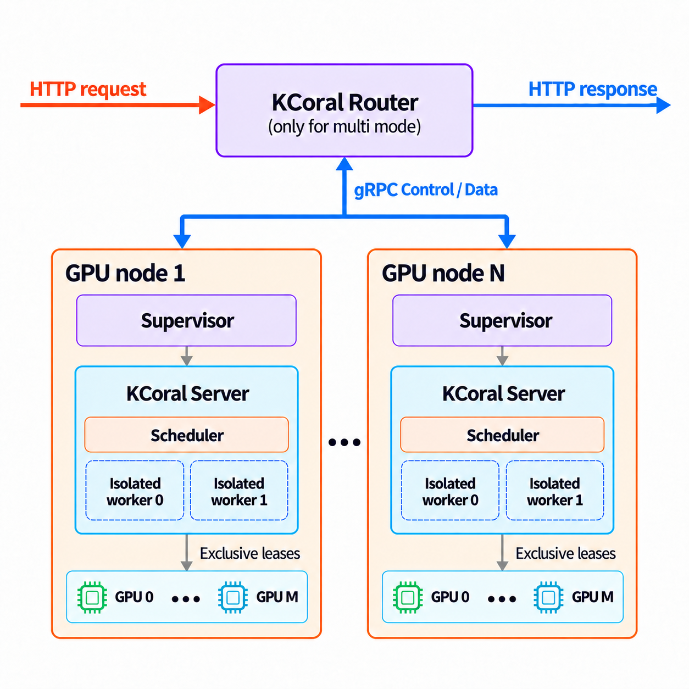

# Launch the router

```{note}
Routed deployments are currently supported only on Linux.
```

The Router gives clients a stable address for a changing pool of compute nodes.
Instead of connecting to individual machines, clients send programs to the
Router, which selects an available node for each request. You can add capacity,
replace a machine, or take a node offline without changing the address clients
use. This separates the lifetime of the client endpoint from that of the GPU
machines doing the work.



## Start a Router and a node

Install the [KCoral package](../getting-started/installation.md) on the Router
host and the [server environment](../getting-started/installation.md#install-the-server)
on each compute node. Use the same KCoral version across the deployment.
Prebuilt packages include the Router and node supervisor; when installing from
source, build them with `KCORAL_BUILD_RUST=1` (see [Install in editable mode](../getting-started/installation.md#install-in-editable-mode)).

```{warning}
KCoral allows clients to execute arbitrary code on its workers. Only allow
trusted clients to access your KCoral server or Router. Deploy on a trusted,
isolated network and never expose these endpoints to the public internet.
Run workers in a sandbox with restricted permissions and access to host resources.
```

To try a routed deployment on one GPU machine, start the Router in one terminal:

```bash
kcoral router --host 127.0.0.1 --port 9000
```

In a second terminal, start a node:

```bash
kcoral server --router http://127.0.0.1:9000 --node-id gpu-a
```

The Router listens on port `9000`. The second command starts a supervisor and
its local KCoral server on GPU `0` by default. The node
registers as `gpu-a` and becomes available once its server is healthy and ready
to receive work. The Router itself does not execute programs or need a GPU.

Check the deployment through the Router's address:

```bash
curl http://127.0.0.1:9000/health
```

Once the node is ready, the Router's `/health` response reports
`"status": "ok"`, the pool's GPU target, and its combined request capacity.
Clients use `http://127.0.0.1:9000` as their
server URL, with the same `Client` and `Program` API used for a standalone
server. See [Writing a program](../client-guide/writing-a-program.md) for
submitting a request.

### How the components work together

The two commands above start three components: the Router, a supervisor, and
the KCoral server that the supervisor manages. The machine running that server
is a compute node; in this example, it is registered as `gpu-a`.

| Component | Role |
| --- | --- |
| Router | Accepts client requests, selects a healthy node with capacity, and forwards programs and results |
| Supervisor | Starts the node's KCoral server, reports its health and capacity, and restarts it if it fails |
| KCoral server | Executes programs in its worker pool, just as in a standalone deployment |

`kcoral server --router ...` starts the supervisor automatically. The supervisor
manages the server's lifetime; programs and results pass between the Router
and the server directly.

### Common settings

- Router `--host 127.0.0.1` and `--port 9000` default to local access on port
  `9000`. Use `--host 0.0.0.0` to accept connections over a trusted network.
- On the server, `--router` specifies which Router to join, and `--node-id`
  identifies the node. Give each node a distinct identifier and keep it stable
  across restarts.
- The Router can require a shared token before allowing nodes to join. This
  check is optional and disabled by default, so nodes can connect without a
  token. To enable it, set the `KCORAL_NODE_TOKEN` environment variable to the
  same value on the Router and each node before launching them, or pass `--node-token` on both commands. The Router then
  rejects node connections with a missing or incorrect token. This check does
  not authenticate clients or encrypt traffic.

To use separate machines, start the Router with `--host 0.0.0.0` on a host
reachable over your trusted network. Replace `127.0.0.1` in node and client URLs
with that host's address, and give each node a distinct `--node-id`. Nodes can
join and leave while clients continue using the same Router address.

Nodes sharing a Router must have matching GPU targets and runtime versions;
incompatible nodes cannot receive work. Use separate Routers for different GPU
architectures or runtime environments.

## Recover from failures and stop nodes

A routed deployment can keep serving requests when a node becomes unavailable,
as long as other compatible nodes have capacity. The supervisor monitors its
local server and restarts it if it fails or stops responding. If the node loses
its Router connection, it attempts to reconnect while continuing to monitor
the server.

Requests already running on a failed node may be interrupted. What clients see
depends on whether the request had started:

| Situation | Client-visible behavior |
| --- | --- |
| The queue is full or the wait for capacity expires | HTTP 503; the request has not been sent to a node and can be retried |
| A connection to a node fails after work may have started | HTTP 502; execution may have occurred, so the Router does not automatically retry the request |
| The client disconnects | Work may still be running on the node; disconnecting does not guarantee that it stops |

To stop a node you launched in a terminal, press **Ctrl+C** in that terminal.
The node stops accepting new work and waits for active requests to finish before
exiting. A background node can be stopped the same way with a SIGTERM signal,
for example `kill <pid>`, where `<pid>` is the process ID of `kcoral server`.
If you use a tool such as systemd to run the node as a background service, allow
enough time in its stop timeout for your longest requests to finish. Forcing
the process to stop before then can interrupt those requests.

Recovery from an unresponsive server is different: the supervisor cannot wait
indefinitely for its requests to finish. It asks the server to stop, then forces
it to exit if necessary so a replacement can restore the node's capacity. The
[supervisor options](#node-connection-and-supervisor-options) control this wait
and the health checks.

As described in the [server cache configuration](launch-the-server.md#cache),
each server keeps its own upload caches. A request sent to a different node may
need to transfer the same content again, and restarting a server clears its
memory cache.

Router and supervisor logs go to the console. Use the request ID to follow a
request across Router events and the [server logs](logging.md) when diagnosing
a failure.

## Configuration

### Router options

These options apply to `kcoral router`. Use `kcoral router --help` to list them.
For the token, an explicit `--node-token` overrides `KCORAL_NODE_TOKEN`.

| Router option | Default | Meaning |
| --- | --- | --- |
| `--host`, `--port` | `127.0.0.1`, `9000` | Router listen address |
| `--status-check-interval-seconds` | `1` | Interval for checking status freshness |
| `--max-status-age-seconds` | `5` | Maximum age of a node health report |
| `--unhealthy-threshold` | `3` | Failed observations before removing a ready node |
| `--recovery-threshold` | `2` | Successful observations before a failed node returns |
| `--queue-wait-timeout-seconds` | `1800` | Maximum wait for capacity |
| `--max-queued-requests` | `1024` | Bound on requests waiting for capacity |
| `--node-retention-seconds` | `600` | Retention of disconnected, unused node records |
| `--max-request-bytes` | `268435456` (256 MiB) | Maximum accepted request body size, in bytes |
| `--node-token` | No token, or `KCORAL_NODE_TOKEN` | Authenticate node connections |

### Node connection and supervisor options

These options apply to nodes launched with `kcoral server`. For execution and
worker settings, see the [server configuration](launch-the-server.md#configuration).
Explicit command-line options take precedence over environment variables.

| Option | Default | Environment variable | Meaning |
| --- | --- | --- | --- |
| `--router` | Disabled | `KCORAL_ROUTER_ENDPOINT` | Router HTTP(S) origin |
| `--node-id` | Unset; required with `--router` | `KCORAL_NODE_ID` | Stable identifier for this node |
| `--node-token` | No token | `KCORAL_NODE_TOKEN` | Bearer token for node connections |

The following advanced options control the supervisor's health checks and
restart behavior. They require `--router` and are omitted from
`kcoral server --help`.

| Option | Default | Meaning |
| --- | --- | --- |
| `--health-interval-seconds` | `2` | Interval between health probes and between control heartbeats |
| `--health-timeout-seconds` | `1` | Timeout for each local health probe |
| `--failure-threshold` | `3` | Consecutive failed health probes before restarting the server |
| `--startup-grace-seconds` | `30` | Initial period during which failed health probes do not trigger a restart |
| `--stable-reset-seconds` | `60` | Healthy running time before resetting restart backoff |
| `--termination-grace-seconds` | `5` | Grace period before force-killing an unhealthy server during restart; normal shutdown waits for requests to finish |
| `--restart-min-delay-seconds` | `1` | Initial restart backoff |
| `--restart-max-delay-seconds` | `30` | Maximum restart backoff before jitter |
| `--restart-jitter` | `0.2` | Random variation in restart delay, as a fraction; accepted range `0`–`0.5` |
